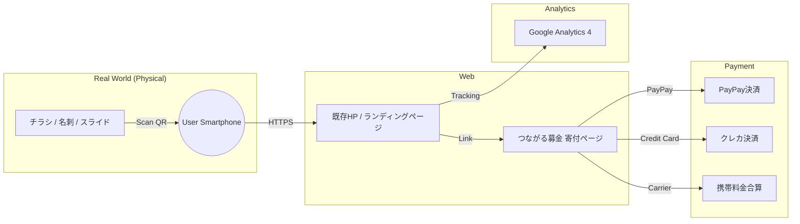

# アーキテクチャ概要

本システムは、チラシ・名刺・イベント投影のQRコードを起点に、スマホでのスムーズな寄付体験を提供します。ソフトバンク「つながる募金」を活用し、低コスト・簡易導入を実現します。

## システム構成図（Mermaid）


## 主要コンポーネント

| コンポーネント | 役割 | 備考 |
|--------------|------|------|
| QRコード | 寄付導線の起点 | チラシ・名刺・イベント投影 |
| 既存HP | 寄付案内ページ | 団体紹介、寄付の使い道 |
| つながる募金 | 決済処理 | PayPay、クレカ、携帯料金合算 |
| Google Analytics 4 | 流入元トラッキング | QR種類ごとの計測 |

## 想定フロー

1. ユーザーがQRコードを読み取り、既存HP（または中継ページ）へアクセス
2. 「PayPayで寄付する」ボタンをタップ
3. つながる募金の寄付ページへ遷移
4. PayPay等で決済完了
5. 寄付完了ページが表示される

## 流入元トラッキング

QRコードにパラメータを付与し、GA4で計測：

```
チラシA用: https://example.org/donate?source=flyer_a
名刺用:    https://example.org/donate?source=namecard
イベント用: https://example.org/donate?source=event_2025
```

## 採用しなかった構成

以下は調査の結果、不要と判断：

| コンポーネント | 理由 |
|--------------|------|
| Cloud Run | 決済API連携が不要のため |
| Firestore | 寄付履歴はつながる募金側で管理 |
| Secret Manager | APIキー管理が不要のため |
| Cloud NAT | 固定IP不要のため |
| Terraform | GCPインフラを使用しないため |

詳細は [ADR-004: 決済プロバイダ選定](./adr/ADR-004-payment-provider-selection.md) を参照。
