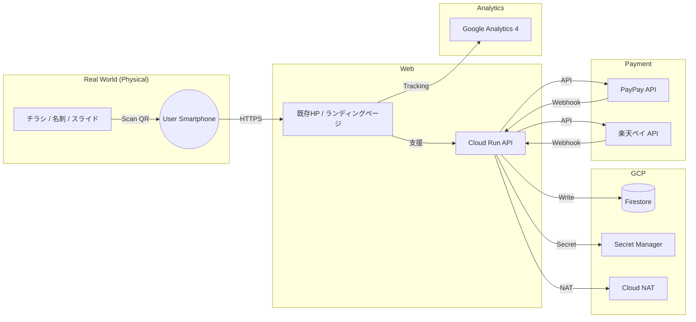

# アーキテクチャ概要

本システムは、チラシ・名刺・イベント投影のQRコードを起点に、スマホでのスムーズな支援決済体験を提供します。PayPay for Developers / 楽天ペイのAPI連携により、決済フローを自前で制御します。

## 重要：対価性のある取引（売上）

タダカヨの「支援」は、研修の提供やグッズの提供など**対価性のある取引**であり、経理上は「売上」として計上します。この位置づけにより、PayPay for Developers / 楽天ペイは**商取引用途**として適合します。

## システム構成図（Mermaid）


## 主要コンポーネント

| コンポーネント | 役割 | 備考 |
|--------------|------|------|
| QRコード | 支援導線の起点 | チラシ・名刺・イベント投影 |
| 既存HP | 支援案内ページ | 団体紹介、支援の使い道 |
| Cloud Run | 決済セッション作成・Webhook受信 | API連携の中心 |
| Firestore | 支援履歴・決済状態の保存 | 監査/集計用 |
| Secret Manager | APIキー・署名鍵の保管 | ローテーション対応 |
| Cloud NAT | 固定IPからのAPI通信 | 決済側のIP制限に対応 |
| PayPay / 楽天ペイ | 決済API | 署名検証が必須 |
| Google Analytics 4 | 流入元トラッキング | QR種類ごとの計測 |

## 想定フロー

1. ユーザーがQRコードを読み取り、既存HP（または中継ページ）へアクセス
2. 支援金額を選択し、Cloud Runへ送信
3. Cloud RunがPayPay/楽天ペイの決済セッションを作成
4. ユーザーが決済画面へ遷移し、支払いを完了
5. 決済プロバイダのWebhookで決済結果を受信
6. 署名検証後、Firestoreへ記録しサンクスページへ誘導

## 流入元トラッキング

QRコードにパラメータを付与し、GA4で計測：

```
チラシA用: https://example.org/support?source=flyer_a
名刺用:    https://example.org/support?source=namecard
イベント用: https://example.org/support?source=event_2025
```

## 採用しなかった構成

以下は現時点で採用しない方針：

| コンポーネント | 理由 |
|--------------|------|
| つながる募金 | 新規受付停止が報告されており、導入が難しい |
| コングラント | 初期コスト/運用コストが高いため後回し |

詳細は [ADR-004: 決済プロバイダ選定](./adr/ADR-004-payment-provider-selection.md) を参照。
