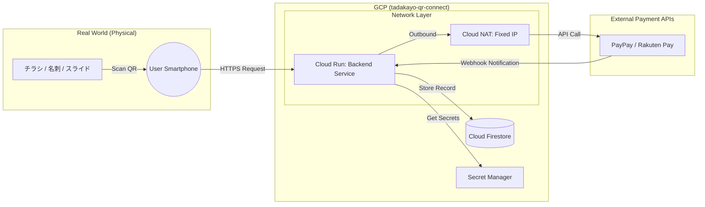

# アーキテクチャ概要

本システムは、チラシ・名刺・イベント投影のQRコードを起点に、スマホでのスムーズな寄付体験を提供します。GCP（Google Cloud）のサーバーレス製品群を活用し、低コスト・高セキュリティ・高拡張性を実現します。

## システム構成図（Mermaid）

## 主要コンポーネント
- QRコード起点の導線: 紙媒体・投影からの流入を統一の寄付フローへ収束
- Cloud Run: APIエンドポイント、決済遷移、Webhook受信を担当
- Firestore: 寄付履歴・決済ステータス・流入元（QR種類）を保存
- Secret Manager: APIキー、Webhook署名鍵を安全に保管
- Cloud NAT: 決済プロバイダ向け固定IPを確保

## 想定フロー
1. ユーザーがQRコードを読み取り、Cloud Runの寄付開始URLへアクセス
2. 決済プロバイダの画面へ遷移し、寄付を完了
3. Webhook通知をCloud Runが受信し、署名検証後Firestoreへ保存
4. 寄付完了ページを表示（将来的にお礼メール送信）
